# [ML]CVD_Predict

# Is your heart at RISK? 
Be it living at the peaceful countryside or among the hustle and bustle of big city, we are subjected to stress at different levels. Keeping your body in good shape isn't just enough to cope with daily tasks, your **heart** needs to **LIVE** through the day too! Here as part of my assessment I have made a Streamlit app that gives a **binary** output(Positive/Negative), aimed to predict the risk of getting cardiovascular disease (CVD) based on several features: 
- `'thalachh'`(Maximum heart rate achieved),
- `'oldpeak'`(ST depression induced by exercise relative to rest),
- `'caa'`(Number of major vessels),
- `'cp'`(Type of chest pain), and
- `'thall'`(Thalium Stress Test result)

I would also like to thank [Rashik Rahman](https://www.kaggle.com/rashikrahmanpritom) for providing the [dataset](https://www.kaggle.com/datasets/rashikrahmanpritom/heart-attack-analysis-prediction-dataset/discussion/234843) to work on, for information about description of data can be obtained [here](http://archive.ics.uci.edu/ml/datasets/Heart+Disease).

## WebApp  Interface
With the help of [Streamlit](https://streamlit.io/) I have managed to create my first WebApp with my favourite clean n' crisp setting, so here is: 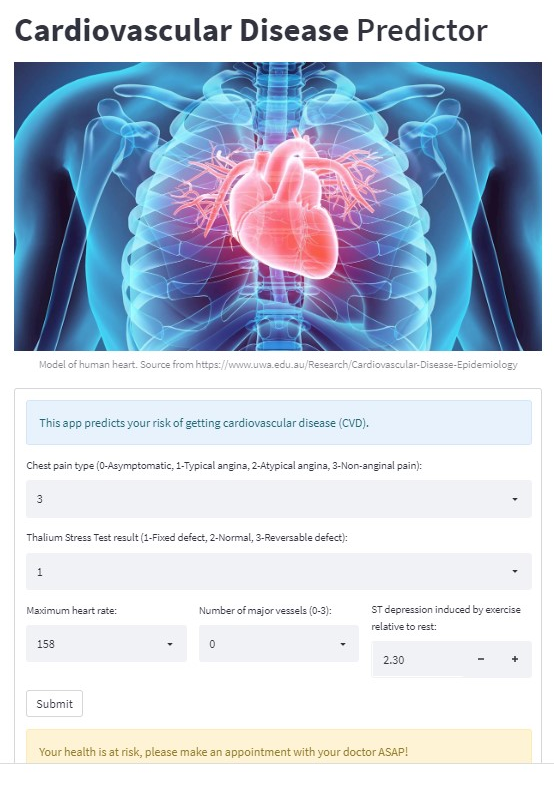

## Model Accuracy
This app is built on a ML model with **87%** accuracy, performance of model is summarised below:

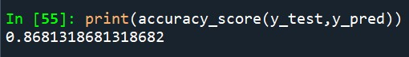

| Classification Report | Confusion Matrix |
| --------------------- | ---------------- |
| 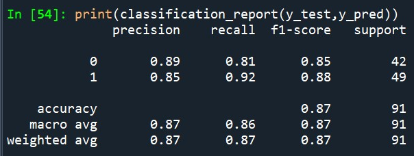 | 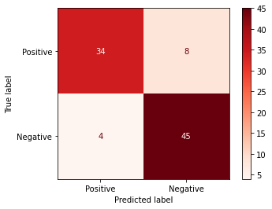 |

### Testing model with new observations
Prior to deploying the model I have also tested the model with several new observations as shown below:
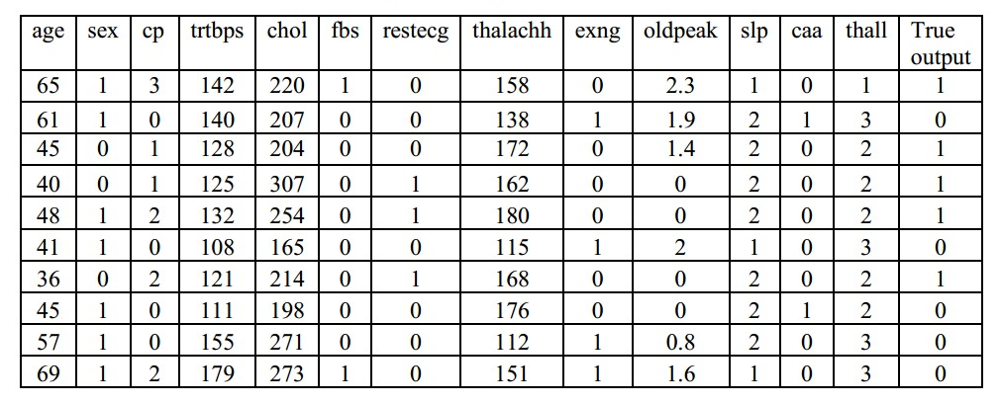

The model is able to achieve **80%** accuracy.
| Classification Report | Confusion Matrix |
| --------------------- | ---------------- |
| 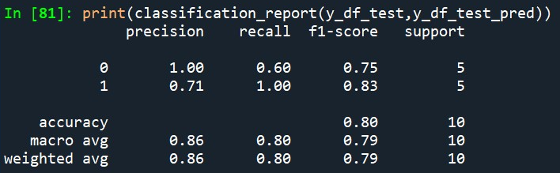 | 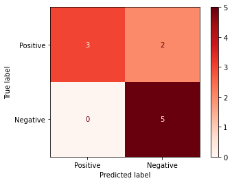 |

## Dataset Overview
The dataset consists of 303 observations and 14 columns `(303,14)`, all of which are numerized:
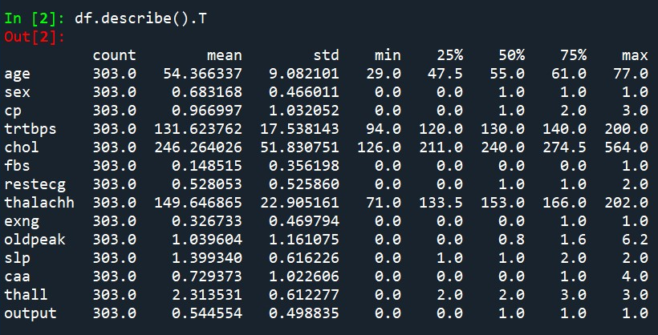

## Data Inspection/ Cleaning
Dataset is fairly balanced:

Upon inspection 1 duplicate observations and 2 null values in `'thall'` are observed:
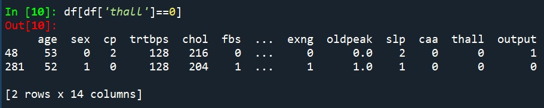
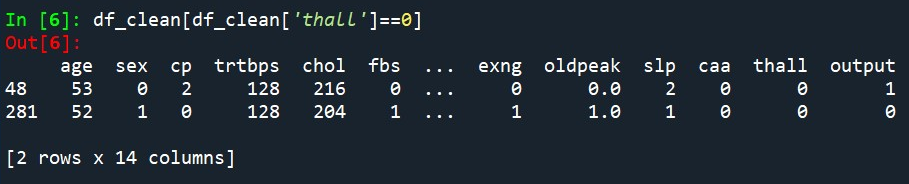

Null value is represented by `0` and hence filled using imputation by median method.

## Feature selection
### Numeric data
**Logistic Regression** is used to infer correlation of selected column to target feature `'output'`:
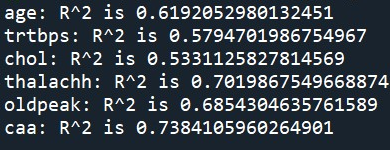

Numeric features with R-squared value lesser than 0.65 are filtered. 

### Categorical data
**Cramer's V** is used to study correlation of categorical features to target feature `'output'`:
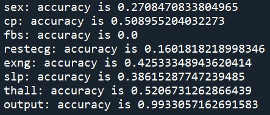

Since most categorical features show low correlation to target column only 'cp' and 'thall' are selected.

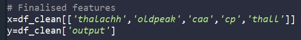

### Train and test data
**Train** and **test** dataset is splitted at 7:3 ratio.

## Pipeline Building
Pipelines with different combinations of scalers and classification models are built and tested as summarised below:
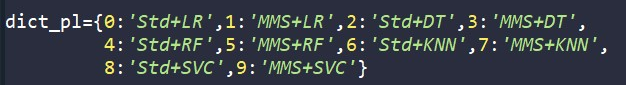

### Best pipeline
Upon testing it is observed that the optimum pipeline is built base on **`StandardScaler()`** with **`LogisticRegression()`**:

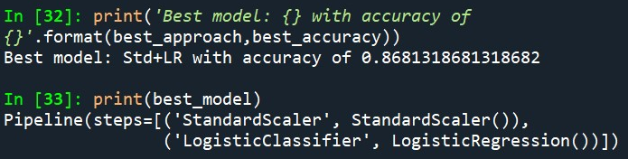

### Finetune pipeline
**GridSearchCV** with cross validation `cv=5` is applied to finetune the optimum pipeline. Hyperparameter `C` and `penalty` are tested out:
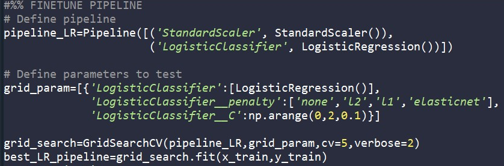

Optimum hyperparamter:

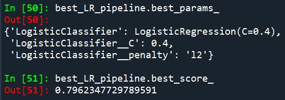

## Discussion
Model is able to achieve 87% and 80% during best pipeline evaluation and testing on new observations respectively. Suggestions to improve model:
- [ ] Train model with a larger dataset.
- [ ] Ensembling methods.

